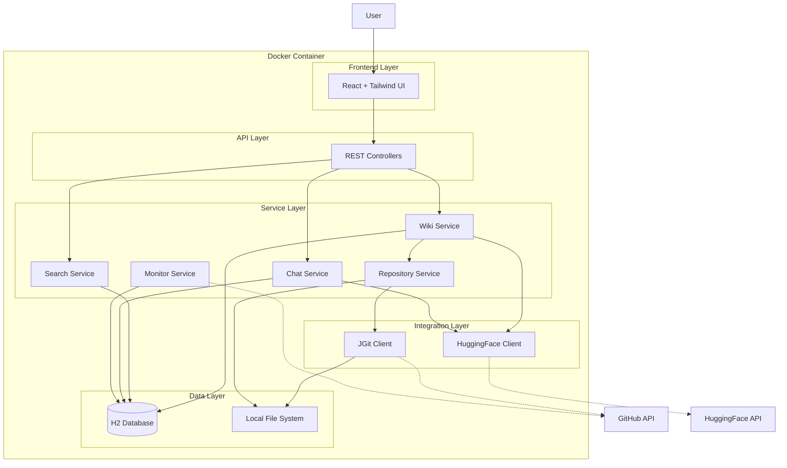
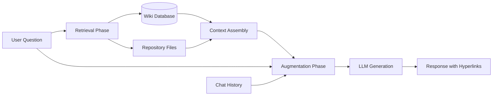
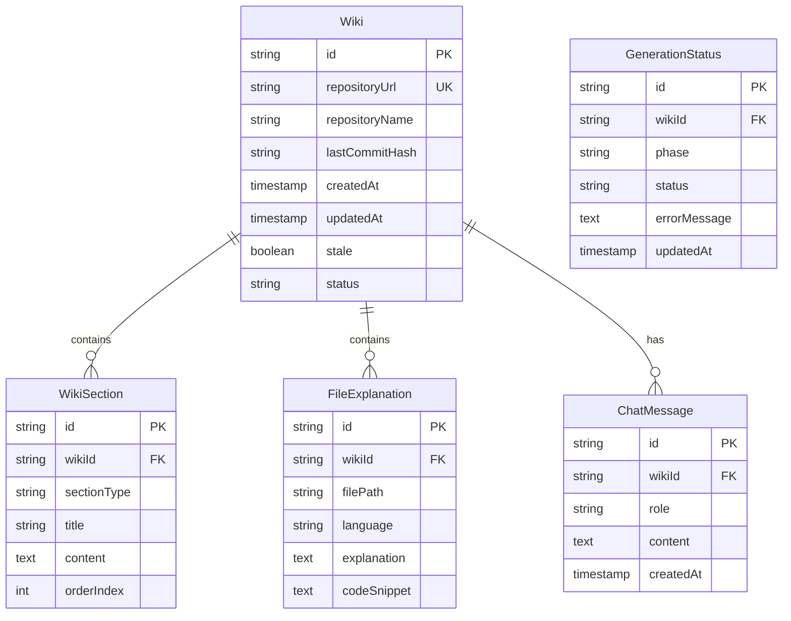

# Technical Design Document: CodeWiki Generator

## Overview

The CodeWiki Generator is a monolithic Spring Boot application that automatically generates comprehensive, wiki-style documentation for public GitHub repositories using AI. The system provides a web interface where developers can submit GitHub repository URLs, which are then validated, cloned, analyzed, and transformed into structured documentation using HuggingFace's LLM API.

The application follows a single-container deployment model with an embedded H2 database for persistence and a React frontend served by the Spring Boot backend. The system supports full-text search across all generated wikis and includes an interactive RAG-based chatbot for answering repository-specific questions.

### Key Design Goals

- **Simplicity**: Single Docker container deployment with minimal external dependencies
- **Performance**: Efficient LLM usage through chunking and caching strategies
- **Scalability**: Rate limiting and concurrent request management
- **Usability**: Responsive UI with real-time status updates and intuitive navigation
- **Reliability**: Comprehensive error handling with retry mechanisms

## Architecture

### High-Level Architecture

The system follows a layered monolithic architecture:



### Component Responsibilities

**Frontend Layer (React)**
- Repository URL submission form
- Wiki display with navigation
- Search interface
- Chatbot UI with conversation history
- Status tracking and progress indicators

**API Layer (REST Controllers)**
- WikiController: Wiki generation, retrieval, regeneration
- SearchController: Cross-wiki search
- ChatController: Chatbot interactions
- StatusController: Generation status polling

**Service Layer**
- WikiService: Orchestrates wiki generation pipeline
- RepositoryService: Validation, cloning, file detection
- ChatService: RAG implementation for chatbot
- SearchService: Full-text search across wikis
- MonitorService: Periodic repository update detection

**Integration Layer**
- JGit Client: GitHub repository cloning and metadata
- HuggingFace Client: LLM API integration with retry logic

**Data Layer**
- H2 Database: Wiki content, metadata, chat history
- File System: Cloned repositories (temporary storage)

## Components and Interfaces

### 1. Repository Service

**Responsibilities:**
- Validate GitHub repository URLs
- Check repository size before cloning
- Clone repositories using JGit
- Detect code files in cloned repositories
- Clean up temporary repository files

**Key Methods:**
```java
public interface RepositoryService {
    ValidationResult validateRepositoryUrl(String url);
    long getRepositorySize(String url) throws GitAPIException;
    Path cloneRepository(String url) throws GitAPIException;
    List<CodeFile> detectCodeFiles(Path repoPath);
    void cleanupRepository(Path repoPath);
}
```

**Validation Logic:**
- URL format: `https://github.com/{owner}/{repo}`
- Repository must be public (accessible without authentication)
- Size check via GitHub API before cloning
- Code file detection using file extension patterns

### 2. Wiki Generator Service

**Responsibilities:**
- Orchestrate multi-phase wiki generation
- Chunk repository code for LLM processing
- Generate overview, architecture, and file explanations
- Assemble wiki sections into cohesive document
- Handle generation failures and retries

**Key Methods:**
```java
public interface WikiGeneratorService {
    Wiki generateWiki(String repositoryUrl, Path repoPath);
    String generateOverview(RepositoryContext context);
    String generateArchitecture(RepositoryContext context);
    List<FileExplanation> generateFileExplanations(List<CodeFile> files);
    String generateComponentInteractions(RepositoryContext context);
}
```

**Generation Pipeline:**
1. **Context Building**: Extract repository metadata, file structure, primary languages
2. **Overview Generation**: High-level purpose and key features (single LLM call)
3. **Architecture Generation**: Component breakdown and design patterns (single LLM call)
4. **File Explanations**: Batch files into chunks, generate explanations (multiple LLM calls)
5. **Component Interactions**: Cross-reference analysis (single LLM call)
6. **Assembly**: Combine sections into structured wiki

**Chunking Strategy:**
- Maximum 8000 tokens per LLM request (model context limit consideration)
- Group related files (same directory) in chunks
- Include file dependencies in context when possible
- Prioritize important files (entry points, core modules)

### 3. LLM Client

**Responsibilities:**
- Connect to HuggingFace Inference API
- Format prompts for code documentation
- Handle API rate limiting
- Implement retry logic with exponential backoff
- Parse and validate LLM responses

**Key Methods:**
```java
public interface LLMClient {
    String generateCompletion(String prompt, Map<String, Object> parameters);
    String generateWithRetry(String prompt, int maxRetries);
    boolean checkApiHealth();
}
```

**Configuration:**
- Model: Qwen2.5-Coder-32B-Instruct (primary) or DeepSeek-Coder-V2 (fallback)
- Temperature: 0.3 (deterministic, focused responses)
- Max tokens: 2048 per response
- Retry strategy: 3 attempts with exponential backoff (1s, 2s, 4s)

**Prompt Engineering:**
- System prompt: "You are a technical documentation expert analyzing code repositories."
- Context injection: Repository metadata, file structure, language info
- Task-specific instructions: Overview vs. architecture vs. file explanation
- Output format constraints: Markdown with specific section headers

### 4. Search Service

**Responsibilities:**
- Index wiki content for full-text search
- Execute search queries across all wikis
- Rank results by relevance
- Extract context snippets around matches

**Key Methods:**
```java
public interface SearchService {
    List<SearchResult> search(String query);
    void indexWiki(Wiki wiki);
    void reindexAll();
}
```

**Search Implementation:**
- Use H2's built-in full-text search (Apache Lucene integration)
- Index fields: wiki overview, architecture, file explanations
- Ranking: TF-IDF with boost for title matches
- Context extraction: 150 characters before/after match

### 5. Chat Service (RAG Implementation)

**Responsibilities:**
- Retrieve relevant wiki sections and code files
- Construct context for LLM
- Generate conversational responses
- Inject hyperlinks to wiki sections
- Maintain conversation history

**Key Methods:**
```java
public interface ChatService {
    ChatResponse askQuestion(String wikiId, String question, List<ChatMessage> history);
    List<WikiSection> retrieveRelevantSections(String wikiId, String question);
    String generateResponse(String question, String context, List<ChatMessage> history);
}
```

**RAG Architecture:**



**Retrieval Strategy:**
- Keyword extraction from question
- Search wiki sections using extracted keywords
- Retrieve top 3 most relevant sections
- Include related code files if mentioned
- Maximum context: 6000 tokens

**Response Generation:**
- Inject retrieved context into prompt
- Include last 3 conversation turns for context
- Instruct LLM to reference wiki sections
- Post-process response to add hyperlinks

**Hyperlink Injection:**
- Pattern matching: "as explained in [section name]"
- Convert to: `[section name](/wiki/{wikiId}/section/{sectionId})`
- Validate section references exist

### 6. Repository Monitor Service

**Responsibilities:**
- Periodically check for repository updates
- Compare local commit hash with remote
- Mark wikis as stale when updates detected
- Schedule regeneration tasks

**Key Methods:**
```java
public interface RepositoryMonitorService {
    void checkForUpdates();
    boolean isRepositoryUpdated(String repositoryUrl, String lastCommitHash);
    void markWikiAsStale(String wikiId);
}
```

**Monitoring Strategy:**
- Scheduled task: Every 24 hours
- GitHub API: Fetch latest commit hash
- Comparison: Local hash vs. remote hash
- Notification: Set `stale` flag in database

### 7. Rate Limiter

**Responsibilities:**
- Limit concurrent wiki generation requests
- Throttle LLM API requests
- Manage request queue
- Provide queue position feedback

**Key Methods:**
```java
public interface RateLimiter {
    boolean tryAcquireGenerationSlot();
    void releaseGenerationSlot();
    boolean tryAcquireLLMSlot();
    void releaseLLMSlot();
    int getQueuePosition(String requestId);
}
```

**Implementation:**
- Concurrent generations: Semaphore with 10 permits
- LLM requests: Token bucket (100 requests/minute)
- Queue: LinkedBlockingQueue with request metadata
- Position tracking: Map of requestId to queue index

## Data Models

### Database Schema



### Entity Definitions

**Wiki Entity:**
```java
@Entity
@Table(name = "wikis")
public class Wiki {
    @Id
    private String id;
    
    @Column(unique = true, nullable = false)
    private String repositoryUrl;
    
    private String repositoryName;
    private String lastCommitHash;
    private LocalDateTime createdAt;
    private LocalDateTime updatedAt;
    private boolean stale;
    
    @Enumerated(EnumType.STRING)
    private WikiStatus status; // PENDING, IN_PROGRESS, COMPLETED, FAILED
    
    @OneToMany(mappedBy = "wiki", cascade = CascadeType.ALL)
    private List<WikiSection> sections;
    
    @OneToMany(mappedBy = "wiki", cascade = CascadeType.ALL)
    private List<FileExplanation> fileExplanations;
}
```

**WikiSection Entity:**
```java
@Entity
@Table(name = "wiki_sections")
public class WikiSection {
    @Id
    private String id;
    
    @ManyToOne
    @JoinColumn(name = "wiki_id")
    private Wiki wiki;
    
    @Enumerated(EnumType.STRING)
    private SectionType sectionType; // OVERVIEW, ARCHITECTURE, INTERACTIONS
    
    private String title;
    
    @Lob
    private String content;
    
    private int orderIndex;
}
```

**FileExplanation Entity:**
```java
@Entity
@Table(name = "file_explanations")
public class FileExplanation {
    @Id
    private String id;
    
    @ManyToOne
    @JoinColumn(name = "wiki_id")
    private Wiki wiki;
    
    private String filePath;
    private String language;
    
    @Lob
    private String explanation;
    
    @Lob
    private String codeSnippet;
}
```

**ChatMessage Entity:**
```java
@Entity
@Table(name = "chat_messages")
public class ChatMessage {
    @Id
    private String id;
    
    @ManyToOne
    @JoinColumn(name = "wiki_id")
    private Wiki wiki;
    
    @Enumerated(EnumType.STRING)
    private MessageRole role; // USER, ASSISTANT
    
    @Lob
    private String content;
    
    private LocalDateTime createdAt;
}
```

### REST API Endpoints

**Wiki Management:**
```
POST   /api/wikis
       Request: { "repositoryUrl": "https://github.com/owner/repo" }
       Response: { "wikiId": "uuid", "status": "PENDING" }

GET    /api/wikis/{wikiId}
       Response: { "id": "uuid", "repositoryUrl": "...", "sections": [...], "fileExplanations": [...] }

POST   /api/wikis/{wikiId}/regenerate
       Response: { "wikiId": "uuid", "status": "IN_PROGRESS" }

GET    /api/wikis/{wikiId}/status
       Response: { "status": "IN_PROGRESS", "phase": "Generating architecture", "progress": 45 }
```

**Search:**
```
GET    /api/search?q={query}
       Response: { "results": [{ "wikiId": "...", "repositoryName": "...", "section": "...", "snippet": "..." }] }
```

**Chat:**
```
POST   /api/wikis/{wikiId}/chat
       Request: { "question": "How does authentication work?", "history": [...] }
       Response: { "answer": "Authentication is handled by...", "references": [...] }

GET    /api/wikis/{wikiId}/chat/history
       Response: { "messages": [{ "role": "USER", "content": "...", "timestamp": "..." }] }
```


## Correctness Properties

A property is a characteristic or behavior that should hold true across all valid executions of a system—essentially, a formal statement about what the system should do. Properties serve as the bridge between human-readable specifications and machine-verifiable correctness guarantees.

### Property Reflection

After analyzing all 85 acceptance criteria, I identified several areas of redundancy:

- Requirements 16.1 and 16.2 both test the same concept (no authentication required)
- Requirements 7.3 and 7.4 both test caching behavior (can be combined into one property about cache retrieval)
- Requirements 3.1, 3.3, 4.1, and 4.3 test sequential workflow steps (can be combined into workflow properties)
- Requirements 5.1, 5.2, 5.3, and 5.4 all test wiki structure completeness (can be combined)
- Requirements 8.1 and 8.2 both test wiki display structure (can be combined)
- Requirements 13.3 and 13.4 both test error message quality (can be combined)

The following properties represent the consolidated, non-redundant set of testable behaviors.

### Property 1: URL Validation Correctness

For any submitted URL, the Repository_Validator should correctly identify whether it is a valid public GitHub repository URL (format: `https://github.com/{owner}/{repo}`) and reject invalid URLs with appropriate error messages.

**Validates: Requirements 1.2, 1.3**

### Property 2: Valid URL Initiates Generation

For any valid GitHub repository URL, submitting it to the system should initiate wiki generation (status transitions to IN_PROGRESS or PENDING).

**Validates: Requirements 1.4**

### Property 3: Size Check Before Clone

For any repository URL, the size validation must be performed before any cloning operation is attempted.

**Validates: Requirements 2.1**

### Property 4: Oversized Repository Rejection

For any repository with size exceeding 10MB, the system should reject the request with an error message indicating the size constraint violation.

**Validates: Requirements 2.2**

### Property 5: Undersized Repository Approval

For any repository with size at or below 10MB, the Repository_Validator should approve it for cloning.

**Validates: Requirements 2.3**

### Property 6: Validation Success Triggers Clone

For any repository that passes validation, a clone operation should be initiated to local storage.

**Validates: Requirements 3.1**

### Property 7: Clone Failure Handling

For any cloning operation that fails, the system should log the error with appropriate context and notify the user of the failure.

**Validates: Requirements 3.2**

### Property 8: Repository Processing Workflow

For any valid repository, the processing workflow should follow the sequence: validation → size check → clone → code file detection → wiki generation. Each step should only proceed if the previous step succeeds.

**Validates: Requirements 3.3, 4.1, 4.3**

### Property 9: Empty Repository Rejection

For any repository containing no code files (based on file extension detection), the system should reject it with an appropriate error message.

**Validates: Requirements 4.2**

### Property 10: Wiki Structure Completeness

For any successfully generated wiki, it must contain all required sections: overview, architecture breakdown, component interactions, and file-by-file explanations organized by directory structure.

**Validates: Requirements 5.1, 5.2, 5.3, 5.4**

### Property 11: Multi-Language Support

For any repository containing files in multiple programming languages, the Wiki_Generator should detect all languages and generate documentation that identifies the language for each file with language-specific insights.

**Validates: Requirements 5.5, 15.1, 15.2, 15.3**

### Property 12: LLM Request Context Inclusion

For any wiki generation request, the LLM_Client should include repository code and context (metadata, file structure, language info) in the API request.

**Validates: Requirements 6.2**

### Property 13: LLM Retry with Exponential Backoff

For any LLM API request that fails, the system should retry up to 3 times with exponential backoff (1s, 2s, 4s delays).

**Validates: Requirements 6.3**

### Property 14: LLM Complete Failure Handling

For any LLM generation where all 3 retry attempts fail, the system should log the error with full context and notify the user of the generation failure.

**Validates: Requirements 6.4**

### Property 15: Wiki Persistence

For any successfully completed wiki generation, the Wiki_Content should be stored in the Wiki_Database with association to its Repository_URL.

**Validates: Requirements 7.1, 7.2**

### Property 16: Wiki Cache Retrieval

For any repository that has been previously processed, requesting its wiki should retrieve the cached Wiki_Content from the database without triggering LLM API calls or regeneration.

**Validates: Requirements 7.3, 7.4**

### Property 17: Wiki Display Structure

For any wiki displayed to users, it must include all required sections (overview, architecture, file explanations) with file explanations organized by directory structure, navigation between sections, and syntax highlighting for code snippets.

**Validates: Requirements 8.1, 8.2, 8.3, 8.4**

### Property 18: Search Across All Wikis

For any search query submitted, the Search_Engine should search across all Wiki_Content in the Wiki_Database (not just a subset).

**Validates: Requirements 9.2**

### Property 19: Search Result Ranking

For any search query that returns multiple results, the results should be ordered by relevance score (descending).

**Validates: Requirements 9.3**

### Property 20: Search Result Completeness

For any search result returned, it must include repository name, matching Wiki_Section reference, and context snippet showing the match.

**Validates: Requirements 9.4**

### Property 21: Search Result Navigation

For any search result clicked by a user, the system should navigate to the specific Wiki_Section referenced in that result.

**Validates: Requirements 9.5**

### Property 22: Chatbot RAG Context

For any question submitted to the Chatbot, the response generation should use both Wiki_Content and repository files as context (RAG implementation).

**Validates: Requirements 10.2**

### Property 23: Chatbot Hyperlink Injection

For any Chatbot response that references wiki sections, the response should include hyperlinks to those sections in the format `[section name](/wiki/{wikiId}/section/{sectionId})`.

**Validates: Requirements 10.3**

### Property 24: Chatbot Hyperlink Navigation

For any hyperlink in a chatbot response, clicking it should navigate to the referenced Wiki_Section.

**Validates: Requirements 10.4**

### Property 25: Chatbot Conversation Context

For any follow-up question in a conversation, the Chatbot should have access to previous messages in the conversation history (at least the last 3 turns).

**Validates: Requirements 10.5**

### Property 26: Chatbot Multi-Language Support

For any question about code in a supported programming language, the Chatbot should be able to generate relevant answers regardless of the language.

**Validates: Requirements 15.4**

### Property 27: Repository Update Detection

For any previously processed repository, the Repository_Monitor should periodically check GitHub for updates by comparing commit hashes.

**Validates: Requirements 11.1**

### Property 28: Stale Wiki Marking

For any repository where an update is detected (remote commit hash differs from stored hash), the Repository_Monitor should mark the associated Wiki_Content as stale.

**Validates: Requirements 11.2**

### Property 29: Stale Wiki Notification

For any wiki marked as stale, when a user requests it, the system should display a notification about available updates and provide an option to regenerate.

**Validates: Requirements 11.3, 11.4**

### Property 30: Wiki Regeneration Replacement

For any regeneration request on a stale wiki, the Wiki_Generator should replace the existing Wiki_Content with newly generated content (not append or create duplicate).

**Validates: Requirements 11.5**

### Property 31: Concurrent Generation Limit

For any set of wiki generation requests, the system should enforce a maximum of 10 concurrent generations, queueing additional requests beyond this limit.

**Validates: Requirements 12.1, 12.2**

### Property 32: Queue Position Feedback

For any queued wiki generation request, the system should provide the queue position to the user.

**Validates: Requirements 12.3**

### Property 33: LLM API Rate Limiting

For any sequence of LLM API requests, the Rate_Limiter should enforce a maximum of 100 requests per minute, delaying requests when this limit is reached.

**Validates: Requirements 12.4, 12.5**

### Property 34: Error Logging Completeness

For any error that occurs in the system, a log entry should be created containing timestamp, context, stack trace, and error category (validation, cloning, LLM, database, or system).

**Validates: Requirements 13.1, 13.2**

### Property 35: User-Friendly Error Messages

For any user-facing error, the system should display a user-friendly error message (avoiding technical jargon) and include recovery suggestions where applicable.

**Validates: Requirements 13.3, 13.4**

### Property 36: System Resilience

For any recoverable error (validation failure, size limit, empty repository), the system should continue operating and be able to process subsequent requests.

**Validates: Requirements 13.5**

### Property 37: Public Access Without Authentication

For any API endpoint or UI feature, access should be granted without requiring authentication headers, tokens, or user registration.

**Validates: Requirements 16.1, 16.2, 16.3**

### Property 38: Generation Status Tracking

For any wiki generation in progress, the system should maintain and expose status information including current phase (validation, cloning, generating overview, etc.) and overall status (PENDING, IN_PROGRESS, COMPLETED, FAILED).

**Validates: Requirements 18.1, 18.2**

### Property 39: Generation Completion Status

For any wiki generation that completes successfully, the status should transition to COMPLETED and the wiki should be displayed to the user.

**Validates: Requirements 18.3**

### Property 40: Generation Failure Status

For any wiki generation that fails, the status should transition to FAILED and error details should be included in the status response.

**Validates: Requirements 18.4**

### Property 41: Status Persistence

For any wiki generation, the status should be persisted and retrievable even after the user navigates away and returns later.

**Validates: Requirements 18.5**

### Property 42: Loading Indicators During Generation

For any wiki generation in progress, the UI should display loading indicators to provide visual feedback to the user.

**Validates: Requirements 17.2**

### Property 43: Progress Updates for Long Operations

For any long-running operation (wiki generation, regeneration), the system should provide progress updates to the user showing the current phase.

**Validates: Requirements 17.3**

### Property 44: Page Load Performance

For any page in the application, the initial render should complete within 2 seconds under standard broadband connection conditions (excluding wiki generation time).

**Validates: Requirements 17.4**

## Error Handling

### Error Categories

The system categorizes all errors into five types for consistent handling and logging:

1. **Validation Errors**: Invalid URLs, oversized repositories, empty repositories
2. **Cloning Errors**: Git operation failures, network issues, authentication problems
3. **LLM Errors**: API failures, timeout, rate limiting, invalid responses
4. **Database Errors**: Connection failures, constraint violations, query errors
5. **System Errors**: Unexpected exceptions, resource exhaustion, configuration issues

### Error Handling Strategy

**Validation Errors:**
- Immediate user feedback with specific error message
- No retry logic (user must correct input)
- Log at INFO level (expected user errors)
- Recovery: User submits corrected input

**Cloning Errors:**
- Retry once after 2-second delay (transient network issues)
- If retry fails, notify user and log at WARN level
- Clean up partial clone artifacts
- Recovery: User can retry submission

**LLM Errors:**
- Retry up to 3 times with exponential backoff (1s, 2s, 4s)
- Log each retry attempt at WARN level
- If all retries fail, log at ERROR level and notify user
- Recovery: User can retry generation later

**Database Errors:**
- Retry transactional operations once
- Log at ERROR level with full stack trace
- Return 500 status to user with generic message
- Recovery: System administrator intervention may be required

**System Errors:**
- Log at ERROR level with full context
- Return 500 status to user
- Continue serving other requests (isolation)
- Recovery: Automatic for transient issues, manual for persistent issues

### Error Response Format

All API errors follow a consistent JSON structure:

```json
{
  "error": {
    "code": "REPOSITORY_TOO_LARGE",
    "message": "Repository size (15.2 MB) exceeds the maximum limit of 10 MB",
    "category": "VALIDATION_ERROR",
    "timestamp": "2024-01-15T10:30:00Z",
    "suggestions": [
      "Try a smaller repository",
      "Contact support if you need to process larger repositories"
    ]
  }
}
```

### Logging Strategy

**Log Levels:**
- DEBUG: Detailed execution flow, variable values
- INFO: Normal operations, successful completions
- WARN: Recoverable errors, retry attempts
- ERROR: Failures requiring attention, unrecoverable errors

**Log Context:**
- Request ID (for tracing)
- Repository URL (when applicable)
- Wiki ID (when applicable)
- User session ID (when applicable)
- Timestamp with millisecond precision

**Log Aggregation:**
- All logs written to stdout (Docker best practice)
- Structured logging using JSON format
- Include stack traces for ERROR level
- Sanitize sensitive information (API keys, tokens)

## Testing Strategy

### Dual Testing Approach

The CodeWiki Generator requires both unit testing and property-based testing for comprehensive coverage:

**Unit Tests** focus on:
- Specific examples demonstrating correct behavior
- Edge cases (empty repositories, single-file repositories, maximum size repositories)
- Error conditions (network failures, API errors, invalid inputs)
- Integration points between components
- UI component rendering and interactions

**Property-Based Tests** focus on:
- Universal properties that hold for all inputs
- Comprehensive input coverage through randomization
- Invariants that must be maintained across operations
- Round-trip properties (serialization, caching)
- Workflow correctness across all valid paths

Together, these approaches provide complementary coverage: unit tests catch concrete bugs in specific scenarios, while property tests verify general correctness across the input space.

### Property-Based Testing Configuration

**Testing Library:**
- Java: jqwik (JUnit 5 integration)
- Minimum 100 iterations per property test (due to randomization)

**Test Tagging:**
Each property-based test must include a comment referencing its design document property:

```java
/**
 * Feature: codewiki-generator, Property 1: URL Validation Correctness
 * For any submitted URL, the Repository_Validator should correctly identify
 * whether it is a valid public GitHub repository URL
 */
@Property
void urlValidationCorrectness(@ForAll("githubUrls") String url) {
    // Test implementation
}
```

**Generator Strategy:**
- GitHub URLs: Generate valid and invalid patterns
- Repository sizes: Generate values around boundary (10MB)
- Code files: Generate various file types and structures
- Wiki content: Generate sections with varying lengths
- Search queries: Generate keywords present and absent in wikis
- Chat questions: Generate questions with varying complexity

### Unit Testing Focus Areas

**Repository Service:**
- Valid GitHub URL formats (example: `https://github.com/owner/repo`)
- Invalid URL formats (example: `https://gitlab.com/owner/repo`)
- Boundary size testing (exactly 10MB, 10MB + 1 byte)
- Empty repository handling
- Network timeout simulation

**Wiki Generator Service:**
- Single-file repository (edge case)
- Large repository with 100+ files (edge case)
- Repository with only README (edge case)
- Mixed language repository (Python + JavaScript)
- LLM response parsing edge cases

**Search Service:**
- Empty search query
- Query with special characters
- Query matching multiple wikis
- Query matching no wikis
- Pagination edge cases

**Chat Service:**
- First question in conversation (no history)
- Question referencing previous answer
- Question about non-existent code
- Question requiring multiple wiki sections
- Hyperlink injection edge cases

**Rate Limiter:**
- Exactly 10 concurrent requests
- 11th concurrent request (should queue)
- Exactly 100 LLM requests in 1 minute
- 101st LLM request (should delay)

### Integration Testing

**End-to-End Workflows:**
1. Submit URL → Validate → Clone → Generate → Display
2. Submit URL → Find cached → Display (no regeneration)
3. Search → Click result → Navigate to section
4. View wiki → Ask question → Click hyperlink → Navigate
5. Detect update → Mark stale → Regenerate → Display new content

**External Service Mocking:**
- GitHub API: Mock repository metadata and clone operations
- HuggingFace API: Mock LLM responses with realistic content
- Use WireMock or similar for HTTP mocking

### Performance Testing

**Load Testing:**
- 10 concurrent wiki generations (at limit)
- 20 concurrent wiki generations (queueing behavior)
- 100 LLM requests per minute (at limit)
- 150 LLM requests per minute (throttling behavior)

**Stress Testing:**
- Maximum size repository (10MB)
- Repository with 500+ files
- Wiki with 100+ sections
- Search across 100+ wikis
- Chat conversation with 50+ messages

### Test Data Management

**Test Repositories:**
- Create small test repositories in GitHub for integration tests
- Include repositories with: single file, multiple languages, various sizes
- Use public repositories that won't change (archived or owned by test account)

**Database:**
- Use H2 in-memory database for unit tests
- Use H2 file-based database for integration tests
- Reset database state between test runs

**LLM Responses:**
- Record real LLM responses for common scenarios
- Use recorded responses in tests (deterministic)
- Periodically refresh recordings to catch API changes

